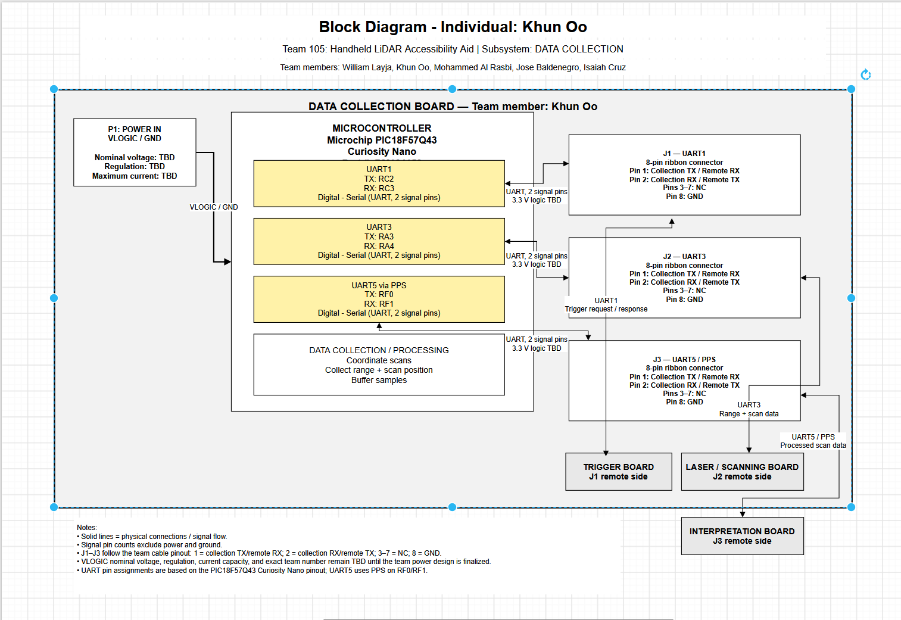

## Overview

The purpose of this block diagram is to show the electrical architecture of my individual subsystem for the **Handheld LiDAR Accessibility Aid**. My subsystem is the **Data Collection Board**, which is responsible for receiving scan and trigger information, coordinating scan data, and sending collected information to the Interpretation Board.

The diagram shows the microcontroller, communication interfaces, power connections, and connections to the other team members' subsystems.

The main parts of my subsystem include:

* **Microcontroller:** PIC18F57Q43 Curiosity Nano
* **Power:** VLOGIC and GND supplied by the team Power Board
* **Data collection:** Receives LiDAR/scanning and trigger information
* **Communication:** UART interfaces are used for communication between boards
* **Team connections:** J1 connects to the Trigger Board, J2 connects to the Laser/Scanning Board, and J3 connects to the Interpretation Board
* **Data processing:** The microcontroller coordinates scan information, scan position, and buffered samples

The Data Collection Board receives power from the team Power Board rather than generating its own primary power. The power and signal connections are separated so that the diagram clearly shows the difference between power distribution and communication signals.

## Individual Block Diagram

**Figure 1:** Individual block diagram for Khun Oo's Data Collection Board.

## Microcontroller

The main microcontroller for my subsystem is the **PIC18F57Q43 Curiosity Nano**. The microcontroller is responsible for coordinating the incoming scan and trigger information and communicating the collected data with the other subsystems.

The microcontroller includes the following communication interfaces:

* **UART1:** Communication with the Trigger Board through J1
* **UART3:** Communication with the Laser/Scanning Board through J2
* **UART5/PPS:** Communication with the Interpretation Board through J3
* **Data processing:** Coordinates scan data, scan position, and buffered samples

The specific MCU I/O pins and signal connections are shown directly in the block diagram.

## Team Connections

My Data Collection Board connects to three other team subsystems:

| Connector | Connected Board | Purpose | Interface |
| --- | --- | --- | --- |
| J1 | Trigger Board | Trigger and scan request communication | UART |
| J2 | Laser/Scanning Board | LiDAR/scanning data communication | UART |
| J3 | Interpretation Board | Sends collected data for interpretation | UART |

The team uses 8-pin ribbon cable connectors. Only the signal pins are counted as microcontroller I/O pins; power and ground are not counted as signal pins.

## Power

The Data Collection Board receives power from the team Power Board.

The primary power connection shown on the block diagram is:

* **VLOGIC**
* **GND**

The final nominal voltage, regulation information, and maximum available current will be updated when the team finalizes the power architecture.

## Communication Signals

The communication connections use digital serial UART signals. Each UART connection uses two signal lines:

* TX — transmit
* RX — receive

The signal connections are bidirectional where required because data can be transmitted and received between the connected boards.

The team ribbon-cable convention is:

* Pin 1: Collection TX / Remote RX
* Pin 2: Collection RX / Remote TX
* Pin 8: GND
* Remaining pins: reserved or not currently assigned

## Design Notes

The block diagram is intended to document the current electrical architecture of the Data Collection subsystem. Component selections, power specifications, and other values marked **TBD** will be updated as the design is finalized.

This diagram will also be updated as the PCB schematic and subsystem interfaces are developed.
